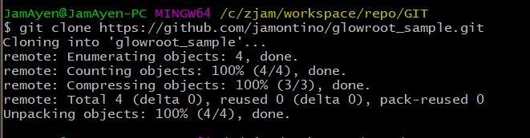
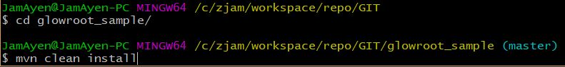
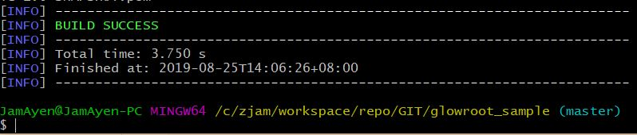
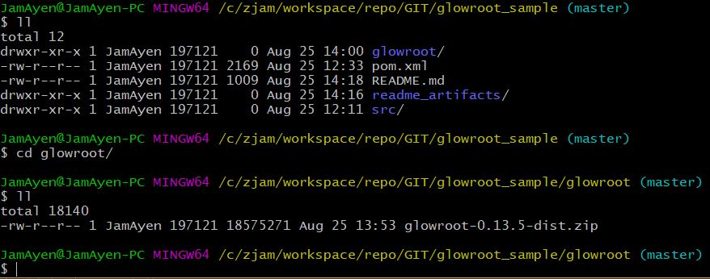
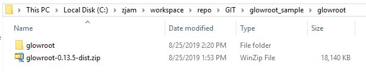
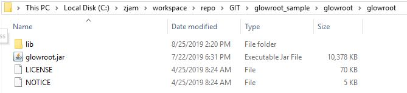
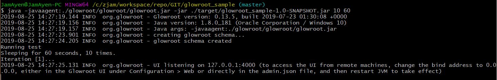
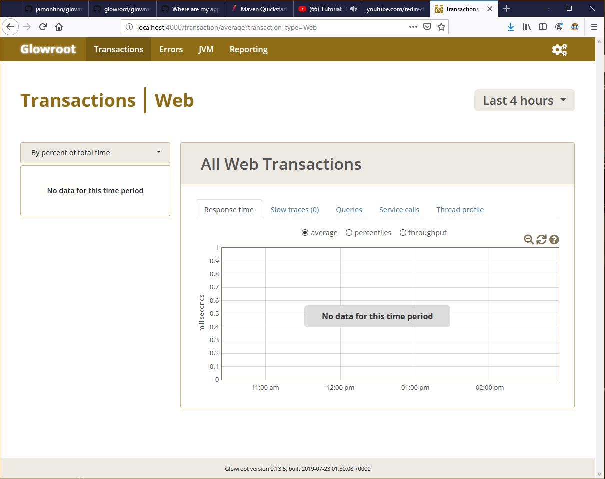

# glowroot_sample

This is a simple project which shows how you can use glowroot for your application 

# How to use this sample

1. Clone this project to your local.


2. Now you'll need to compile the project. Navigate to where the project is and run "mvn clean in"

Once done, you should see something like below if Maven was successful.


3. Give the above a quick test run to make sure everything is running fine.
Run the test application using :
`java -jar ./target/glowroot_sample-1.0-SNAPSHOT.jar 5 4`


4. Now that everything works fine, let's unpack glowroot into the project.
I've included a glowroot zip distribution in this project but feel free to replace it if you want another version.


5. Unpack the glowroot zip in the same folder.
Once you're done, you should have something like this.
 


6. Now we're ready to run glowroot!
To run glowroot with our sample app, we need to bump up the original parameters we used.
We will also need to include the glowroot jar as a JVM parameter.
Use this command to run the sample:
```java -javaagent:./glowroot/glowroot/glowroot.jar -jar ./target/glowroot_sample-1.0-SNAPSHOT.jar 10 60```

7. After running above, you should see something like this on your console:


8. Open glowroot on your browser. The default site is `http://localhost:4000`.


9. Congrats! you just got glowroot up and running!